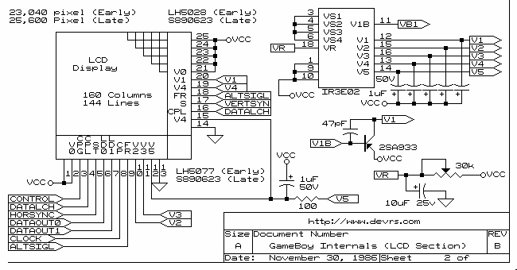

# Ressources
## Gameboy [DMG]

### Links
 - [Schmatics & more](http://www.devrs.com/gb/hardware.php#hardgb)
 - [Capacitors, Schematics & more](https://console5.com/wiki/Game_Boy_DMG-01)
### Schematics
#### Mainboard

#### Powersupply

#### Display

## Gameboy Color [CBG]
### Schematics

 - [Service Manual](assets/gameboy_color_service_manual.pdf)
### Links
 - [Console5](https://console5.com/wiki/Game_Boy_Color)

## Gameboy Pocket [MGB]
### Schematics
### Links
 - [Schematics & Board Diagrams](https://github.com/Gekkio/gb-schematics)

## Gameboy Advance [AGB]
### Schematics
#### Mainboard [CPU]

#### Powersupply

### Links

## Gameboy Advance SP [AGS]
### Schematics
### Links
 - [Schematics & Board Diagrams](https://github.com/Gekkio/gb-schematics)
