# Ressources

## Overview
### Mainboard
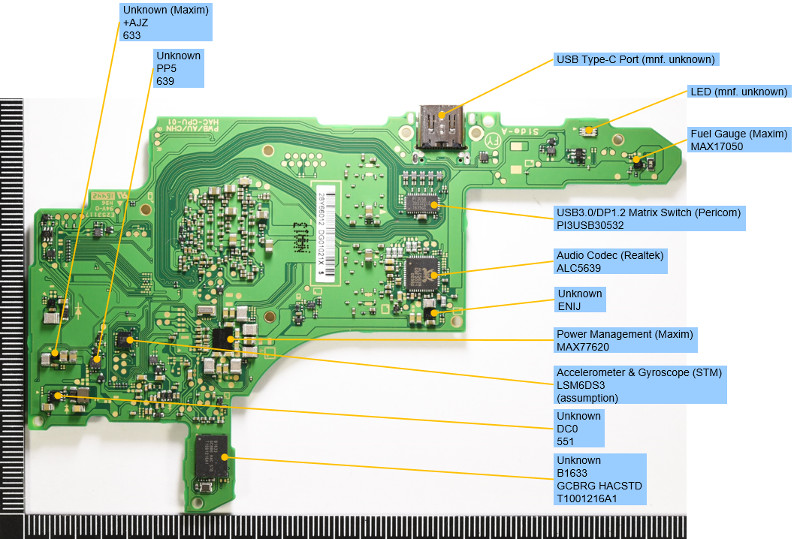
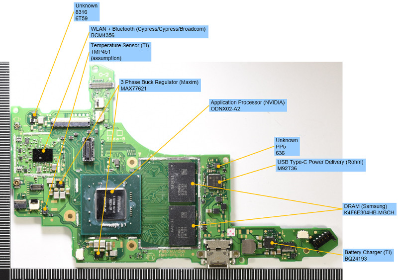

### Cardslot

### Dock
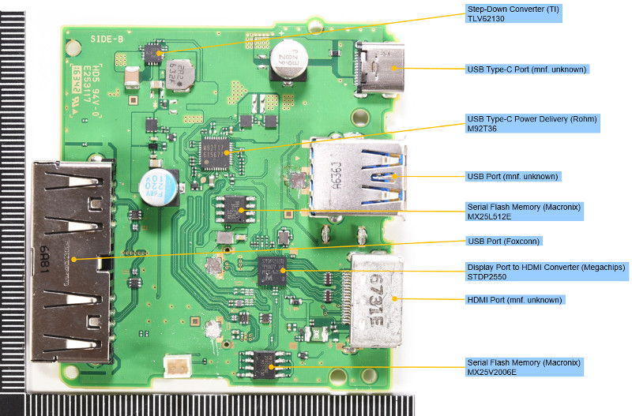

### Joycon
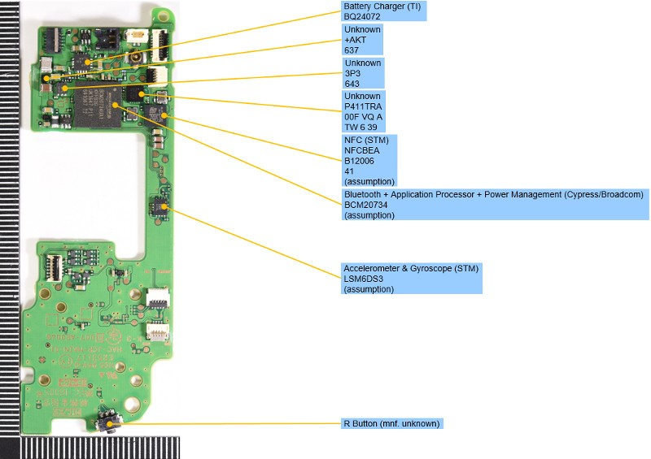

## Voltages
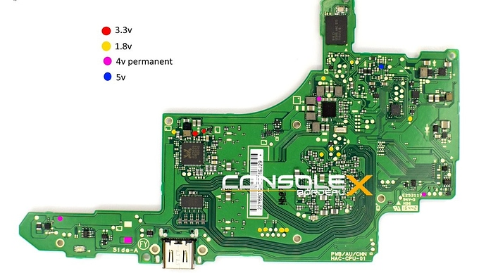

## Diode Mode Readings
Set your Multimeter to "Diode Mode", connect the RED-probe to ground [GND] and measure with the black probe.
### BQ
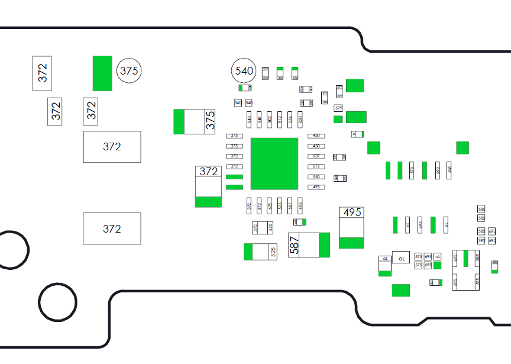

### M92T36
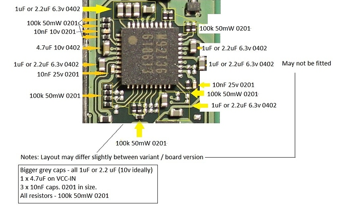

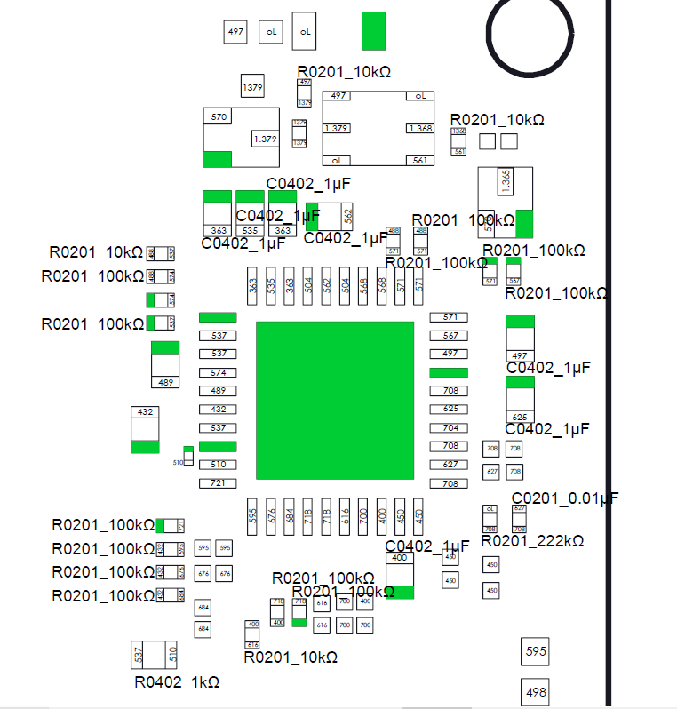

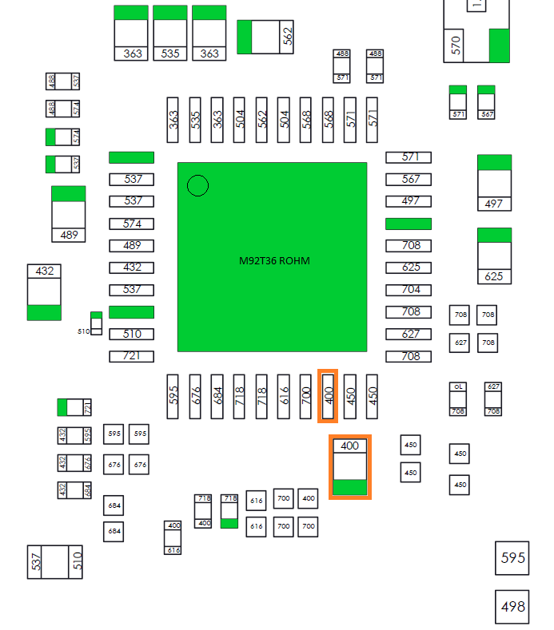

### PI13USB
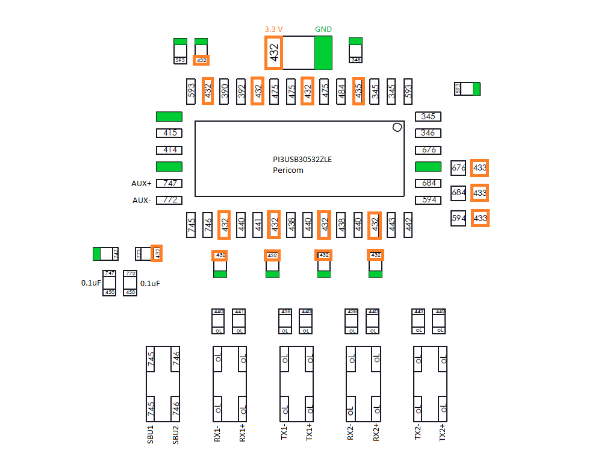

### Under APU
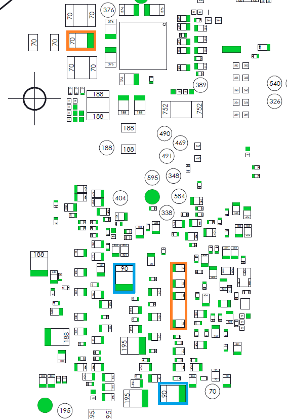

### USB-C
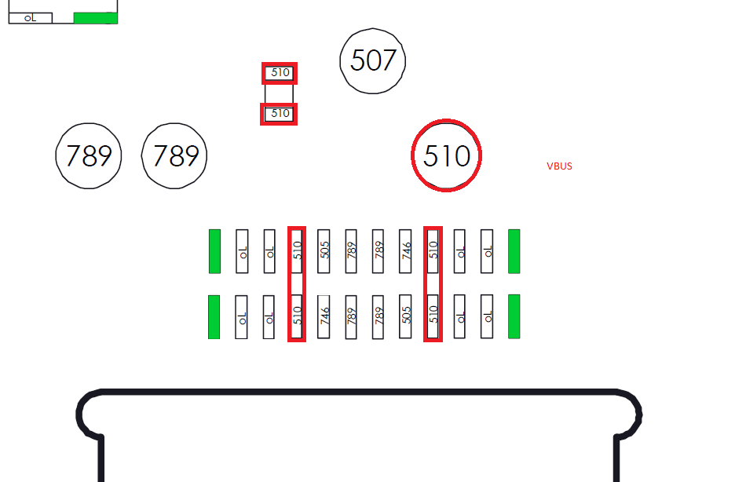

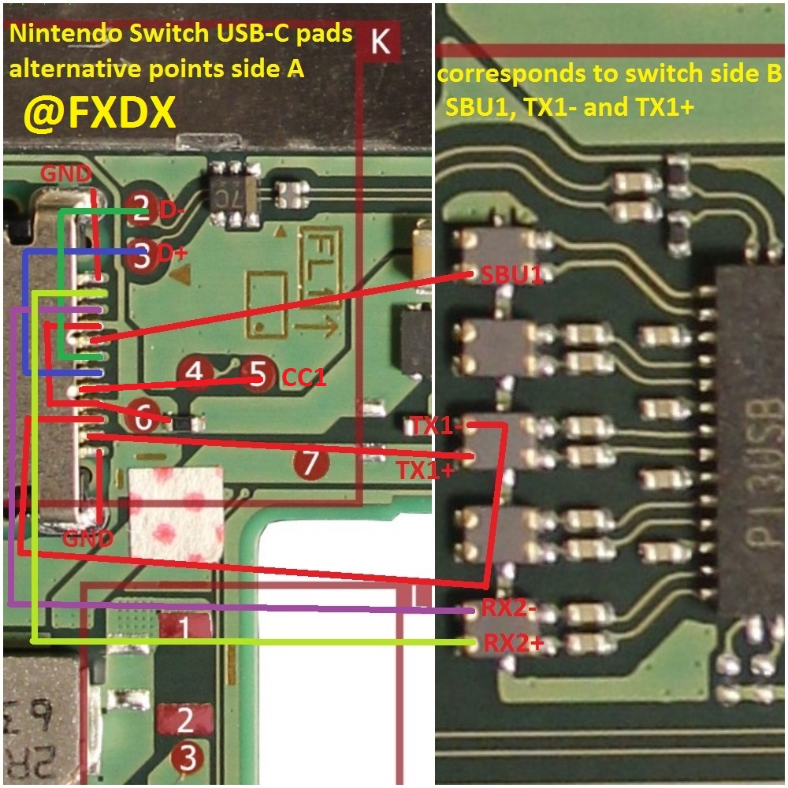

## Links
 - [Diode-Mode Readings](https://logi.wiki/index.php/Game_Console_Diode_Mode_Measurements)
