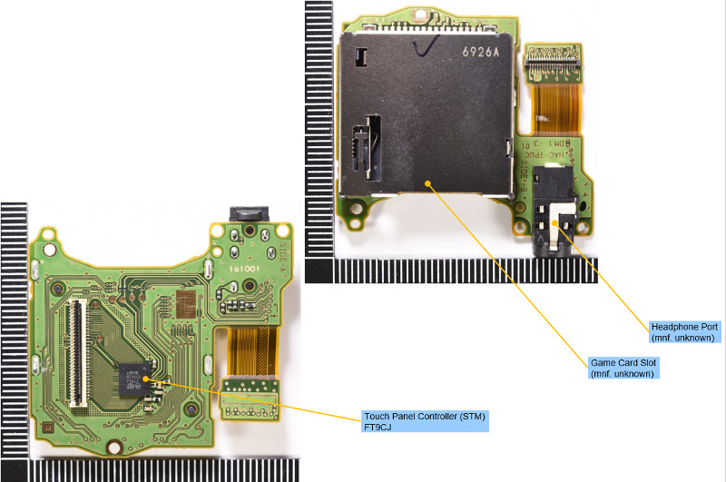
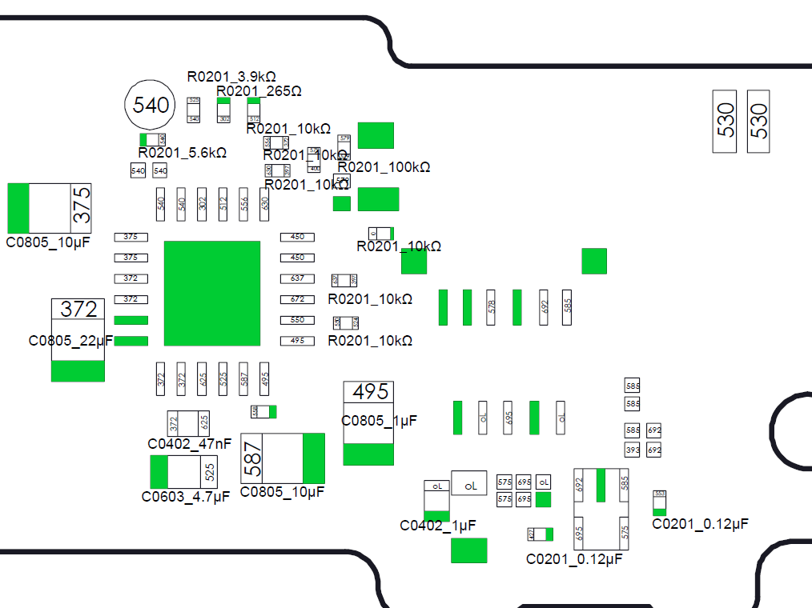

# Ressources

## Overview
### Mainboard

### Cardslot

### Dock

### Joycon

## Voltages

## Diode Mode Readings
Set your Multimeter to "Diode Mode", connect the RED-probe to ground [GND] and measure with the black probe.
### BQ

### M92T36

### PI13USB

### Under APU

### USB-C

## Links
 - [Diode-Mode Readings](https://logi.wiki/index.php/Game_Console_Diode_Mode_Measurements)
