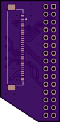
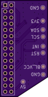

# My Cyberdeck Build

I'm a big long time cyberpunk fan even before reading Neuromancer. After getting addicted to mechanical keyboards and building many portable gaming consoles, i feel like it's time to finally build my own cyberdeck!

The deck is supposed to be a portable computer like a notebook. Small but usable. The GPIO & other external interfaces of the SBC [Single Board Computers] should all be accessable from the outside. For the keyboard there is only one option, a mechanical one. Preferable a custom build, or something in the 60% to 40% area. A mouse is optinal but a trackpad/-ball would be benefitial.

## Planned Features

### Must have

 - Batteries with charge & play
 - Powerfull SBC
 - Mechanical keyboard
 - GPIO breakout
 - Internal Speakers

### Should have

 - Trackball / -pad
 - Software defined radio with external antenna
 - Internal USB-Hub for additional internal devices [SDR, GPS, Keyboard, ...]
 - EL-Wire for cyberpunk fanciness

### Could have / other ideas

 - GPS with internal antenna
 - Solar panel for charging
 - External wifi antenna
 - LoRa?

## Components

|    Part     |          Description           |
|-------------|--------------------------------|
| [Rock Pi N10](https://wiki.radxa.com/RockpiN10) | Powerfull SBC to drive my deck |
| [HD702E LCD](https://www.friendlyarm.com/index.php?route=product/product&product_id=230)  | 7" Display with eDP interface |
| [JJ50](https://kprepublic.com/products/jj50-50-custom-keyboard-pcb-similar-with-preonic)  | Small mechanical keyboard |
| [Trackball](https://shop.pimoroni.com/products/trackball-breakout) | The Pimoroni Trackball Breakout seems like a good option |
| Batteries   | Depends on the space i have in the case |
| [RetroPSU](https://www.heldergametech.com/shop/gameboy-zero/retropsu/) | Helder's RetroPSU seems like a good battery management solution |
| ELWire & Transformator | Ordered some green ELWire with a cheap 5V transformator, let's hope it's not too noisy |

## Case 

I will design the case from scratch in fusion 360 and will be made open source if it turns out good.

## Custom PCBs

### eDP Adapter

To match the eDP interface of the Rock Pi N10 to the display, i had to design a custom PCB. The design is already finished & the PCBs have been produced by OSHPark.

## Software

### Theming XFCE

- https://www.xfce-look.org/p/1320508/
- https://www.xfce-look.org/p/1400299/
- https://www.xfce-look.org/p/1559880/
- https://www.xfce-look.org/p/1315893/
- https://www.xfce-look.org/p/1408367/
- https://www.xfce-look.org/p/1306506/
- https://www.xfce-look.org/p/1508333/
- https://www.xfce-look.org/p/1613474/
- https://www.pling.com/p/1235909/

### Icons

- https://www.xfce-look.org/s/XFCE/p/1460991
- https://www.xfce-look.org/s/XFCE/p/1316887
- https://www.xfce-look.org/s/XFCE/p/1436570

### Conky

- https://www.pling.com/p/1115068
- https://www.pling.com/p/1112273
- https://www.pling.com/p/1114967
- https://www.pling.com/p/1197920
